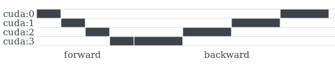
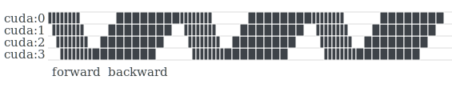
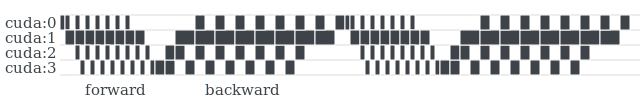

Understanding GPipe
===================

GPipe uses (a) :ref:`pipeline parallelism` and (b) automatic recomputation of
the forward propagation during the backpropagation, hence leverages training a
large model. We refer to (b) as :ref:`checkpointing`, following the well-known
terminology in PyTorch community.

Pipeline Parallelism
~~~~~~~~~~~~~~~~~~~~

GPipe splits a model into multiple partitions and places each partition on a
different device to occupy more memory capacity. For example, we may split a
model occupying 40GB of CUDA memory into 4 partitions each occupying 10GB,
respectively.

This approach is called `model parallelism`. However, typical deep learning
models are composed of sequential layers. In other words, usually the latter
layer wouldn't work until the prior layer has finished. If a model is composed
of fully sequential layers, even if we spread the model over two or more
devices, only one device can be utilized at once.

GPipe splits a mini-batch into multiple micro-batches to make the devices work
as parallel as possible. It is called `pipeline parallelism`. Basically,
pipeline parallelism is a stack of small data parallelism. When each partition
has finished processing a micro-batch, it can toss the output to the next
partition and immediately can start to work on the next micro-batch. Now the
partitions can be overlapped.

.. seealso::
   `Model Parallel Best Practices in PyTorch Tutorials
   <https://pytorch.org/tutorials/intermediate/model_parallel_tutorial.html>`_

There is still idle time called `bubble` because every partition has to wait
for the first micro-batch from the prior partition. The bubble can be reduced
by choosing a smaller size of micro-batches. But usually, larger batch size can
utilize GPU more efficiently. Hence, GPU may be underutilized if too small size
of micro-batches is chosen.

A faster partition should wait for adjacent slower partition. Therefore,
imbalance over partitions also may cause GPU underutilization. Note that the
overall performance is determined by the slowest partition.

Checkpointing
~~~~~~~~~~~~~

Checkpointing is applied to each partition to minimize the overall memory
consumption by a model. During forward propagation, only the tensors at the
boundaries between partitions are remembered. All other intermediate tensors
are volatilized, and recomputed during backpropagation when necessary.
Specifically, hidden layers consume the memory which is required by only a
single micro-batch with checkpointing.

Checkpointing is a trade-off between performance and memory, because
recomputation spends time just as much as the forward propagation. When you use
:class:`torchgpipe.GPipe`, you can decide to turn off checkpointing by
``checkpoint='never'`` option.

Deferred Batch Normalization
~~~~~~~~~~~~~~~~~~~~~~~~~~~~

One of the goals of GPipe is `transparency`. GPipe shouldn't affect existing
hyperparameters and output during training. However, if a module processes per
mini-batch, not per single sample, it might be affected by GPipe since each
module could see only a micro-batch at once.

Meanwhile, batch normalization is a module commonly used in CNN. The forward
propagation of this module performs two procedures in training. Both the
procedures are per mini-batch, not micro-batch:

1. Normalizing a mini-batch by the average and variance of the just given
   mini-batch.
2. Tracking moving statistics (mean and variance) of mini-batches to normalize
   batches in evaluation.

GPipe couldn't provide transparency for the first procedure (normalization).
Per mini-batch normalization introduces a dependency among the micro-batches,
hence it breaks the parallelism of GPipe. But the second procedure (tracking
moving statistics) could be transparent with GPipe by accumulating statistics
of all micro-batches.

:mod:`torchgpipe` provides this functionality as `deferred batch
normalization`. But in the current implementation, it is slower than the
vanilla batch normalization. That is why we turn off by default. If you need
transparent moving statistics, turn on by ``deferred_batch_norm=True`` option
in :class:`~torchgpipe.GPipe`::

   model = GPipe(model, balance=[1, 1, 1, 1], chunks=8,
                 # Turn on deferred batch normalization.
                 deferred_batch_norm=True)
